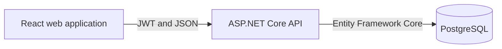
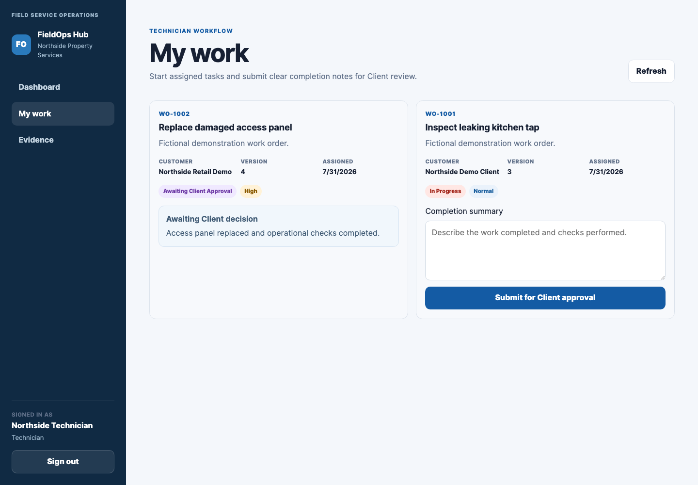
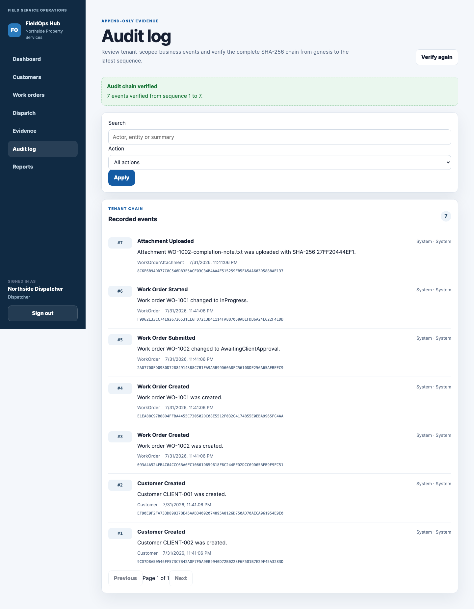

# FieldOps Hub

FieldOps Hub is a multi-tenant field service operations system built with React, TypeScript, ASP.NET Core, Entity Framework Core and PostgreSQL.

## Overview

The system covers the operational lifecycle of a field-service request:

1. A dispatcher creates and assigns a work order.
2. A technician starts the assigned work and records completion details.
3. Supporting files are attached to the work order.
4. A linked client approves the result or reopens the work.
5. Administrators review the audit history and operating metrics.

## Capabilities

- Tenant-scoped customer and work-order management
- Dispatcher assignment and reassignment
- Technician task execution and completion submission
- Client approval and reopen workflow
- Controlled PDF, PNG, JPEG and TXT attachments
- SHA-256 attachment integrity metadata
- Append-only audit history
- Operational metrics and CSV export
- Local development and container deployment

## Architecture

The API is implemented as a modular monolith. Tenant identity is taken from validated JWT claims and applied through role policies, Entity Framework query filters and tenant-aware PostgreSQL relationships.

## Security controls

- PBKDF2 password hashing
- Signed JWT tenant and role claims
- Tenant Admin, Dispatcher, Technician and Client policies
- Tenant-scoped query filters
- Composite tenant relationships
- Optimistic work-order concurrency
- Attachment type and size restrictions
- Per-tenant audit hash chains
- PostgreSQL protection against audit updates and deletes
- npm and NuGet vulnerability checks

## Application

### Dispatch and field execution

### Completion files and client review

### Audit and reporting

## Local development

On macOS, double-click:

`START_LOCAL_DEMO.command`

The launcher selects available ports for PostgreSQL, the API and the web application.

Demonstration tenant:

`northside-property-services`

Demonstration password:

`FieldOps-Demo-2026!`

Accounts:

- `admin@northside.example.test`
- `dispatcher@northside.example.test`
- `technician@northside.example.test`
- `client@northside.example.test`

All demonstration accounts and records are fictional.

## Container deployment

On macOS, double-click:

`START_PRODUCTION_DEMO.command`

The deployment includes:

- Nginx serving the compiled React application
- ASP.NET Core API
- PostgreSQL 17
- Persistent database storage
- Runtime-generated secrets
- Database migrations and repeatable demonstration data
- Service health checks

See [Deployment](docs/DEPLOYMENT.md) for the manual Docker Compose workflow.

## Verification

The current release is covered by:

- 38 unit tests
- 43 PostgreSQL integration and API security tests
- 17 frontend unit and component tests
- Frontend lint and production build
- npm and NuGet vulnerability scans
- Local and production Docker Compose validation
- Production API and web image builds
- Documentation, link and repository naming checks

## Documentation

- (docs/README.md)
- (docs/PROJECT_SCOPE.md)
- (docs/architecture/README.md)
- (docs/SECURITY.md)
- (docs/TESTING.md)
- (docs/DEPLOYMENT.md)
- (docs/OPERATIONS.md)
- (docs/screens/README.md)
- (CONTRIBUTING.md)
- (CHANGELOG.md)

## Limitations

A public production deployment would additionally require HTTPS termination, managed secrets, encrypted backups, central observability, object storage, malware scanning, MFA and a documented disaster-recovery process.
