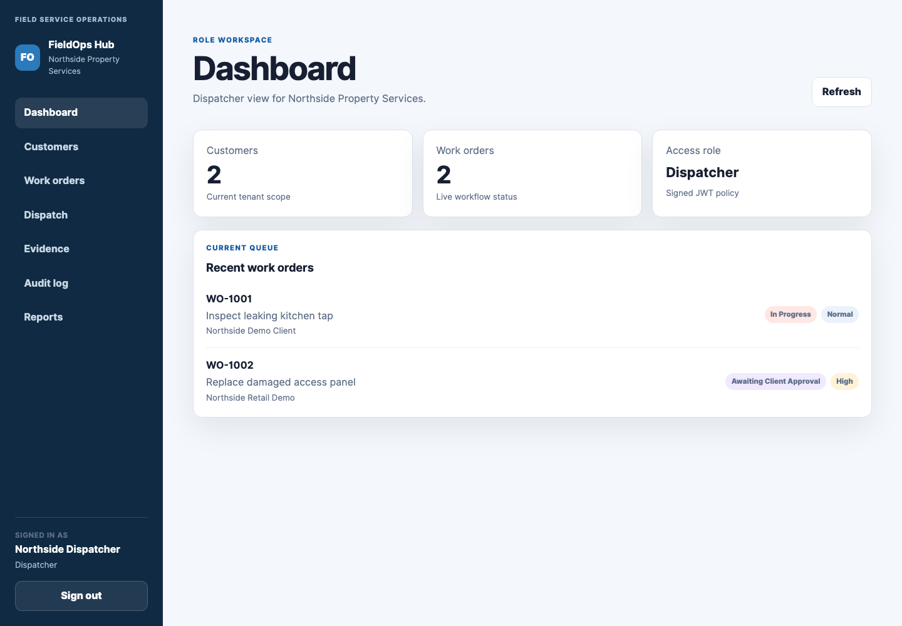
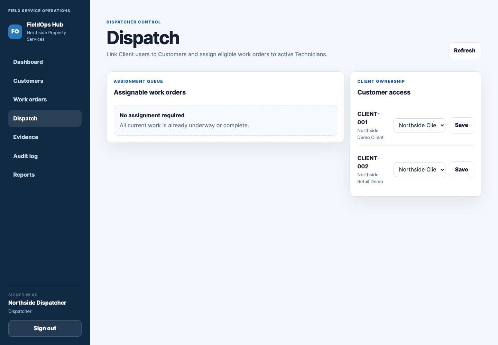
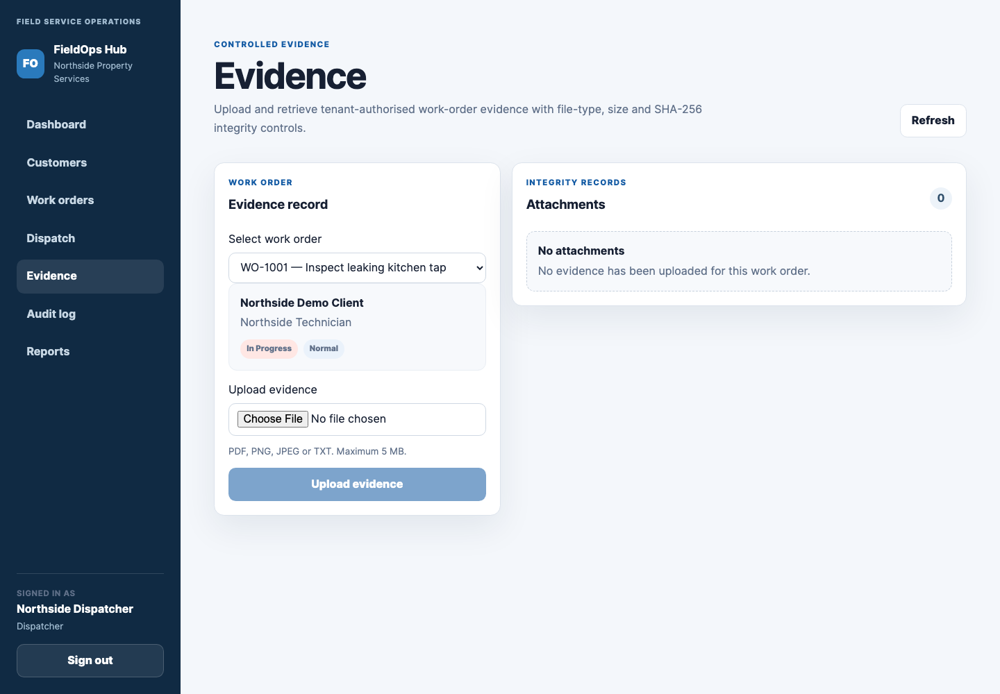
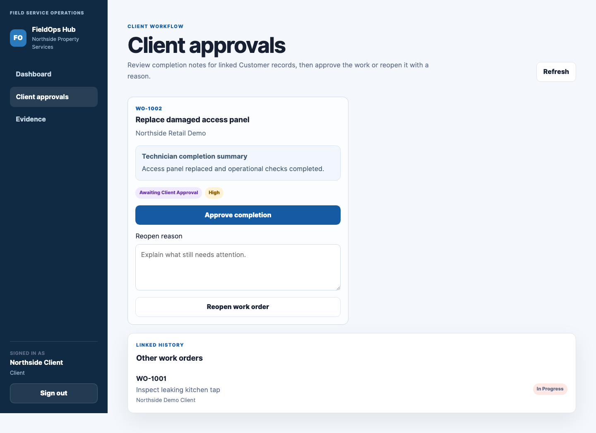
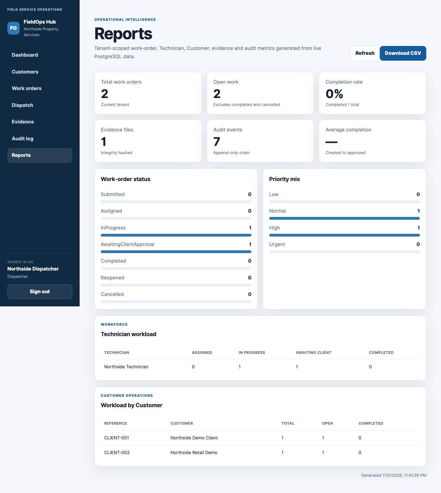
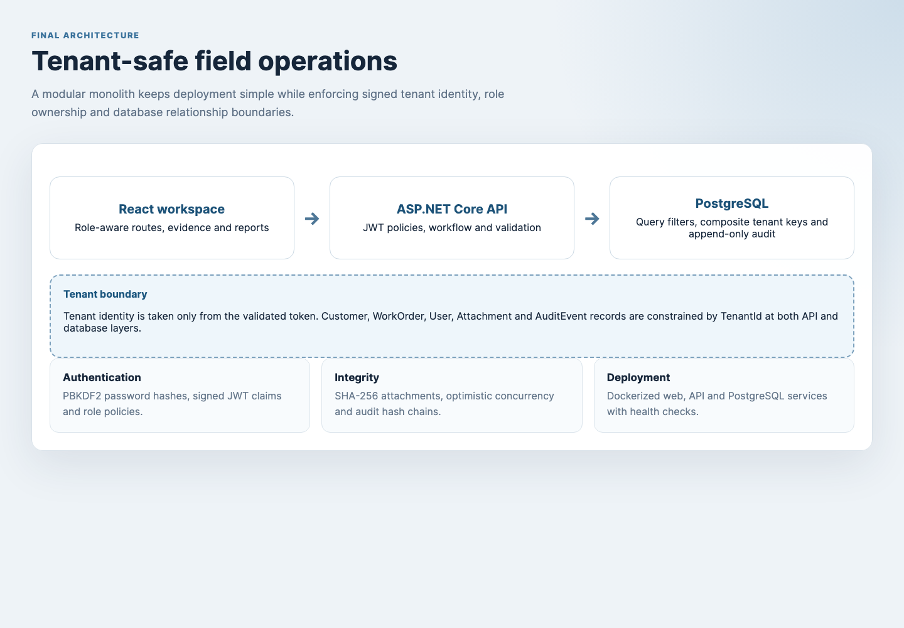
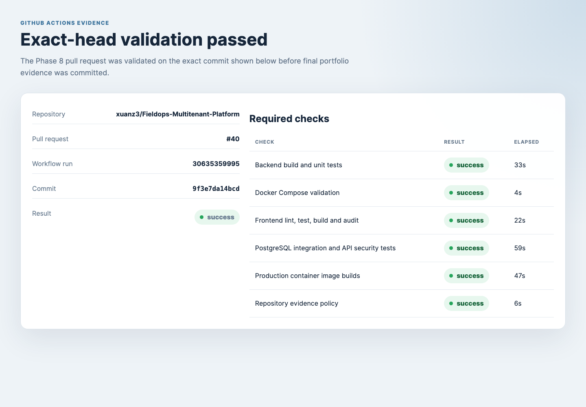
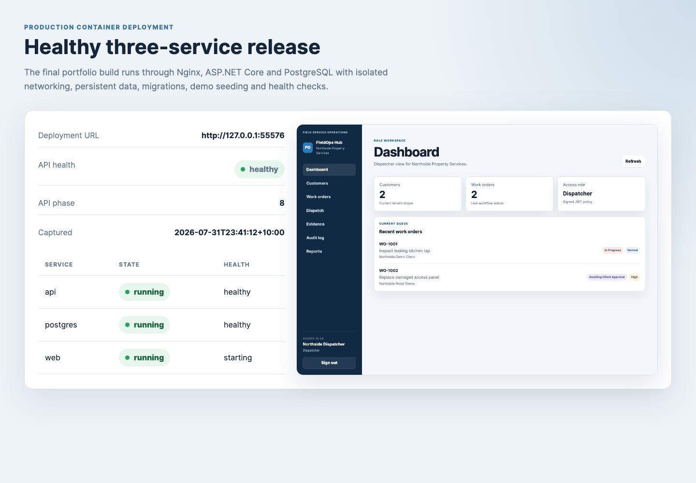

# FieldOps Hub

A multi-tenant field service operations platform built with React, TypeScript, ASP.NET Core, Entity Framework Core and PostgreSQL.

## Product

FieldOps Hub models an operational workflow from client request through dispatch, field execution, completion evidence and client approval.

- Tenant Admin manages the complete tenant workspace.
- Dispatcher maintains customers, creates work orders and assigns technicians.
- Technician starts assigned work and submits completion notes and evidence.
- Client reviews linked work and approves or reopens it.
- Audit and reporting provide management visibility and integrity evidence.

## Key engineering outcomes

- signed JWT tenant identity
- PBKDF2 password hashing
- four role policies
- tenant-scoped Entity Framework query filters
- composite PostgreSQL tenant relationships
- optimistic WorkOrder concurrency
- controlled PDF, PNG, JPEG and TXT attachments
- 5 MB upload limit
- SHA-256 file integrity metadata
- per-tenant append-only audit chain
- PostgreSQL trigger preventing audit updates and deletes
- operational metrics and CSV export
- production-style Docker deployment
- automated final evidence and demo recording

## Product evidence

### Dispatch and field execution

### Evidence and client decision

### Audit and reporting

## Architecture

The browser communicates with an ASP.NET Core modular monolith. Tenant identity is derived only from validated token claims. The API applies role ownership and validation, while PostgreSQL provides relationship constraints, query-filtered persistence, optimistic concurrency and append-only audit protection.

## Verification

Final validation includes:

- .NET build
- 38 unit tests
- 43 PostgreSQL integration and API security tests
- 17 frontend unit and component tests
- frontend production build
- npm moderate-severity audit gate
- NuGet transitive vulnerability scan
- production web and API image builds
- production Compose health validation
- evidence upload/download smoke test
- audit-chain verification
- report and CSV export smoke test
- evidence prerequisite exact-head GitHub Actions run `30635359995`

## Deployment

### Local development demonstration

On macOS:

`START_LOCAL_DEMO.command`

The launcher selects free PostgreSQL, API and frontend ports automatically.

### Production container demonstration

On macOS:

`START_PRODUCTION_DEMO.command`

The production stack contains:

- Nginx and compiled React assets
- private ASP.NET Core API
- private PostgreSQL 17 database
- persistent database volume
- generated runtime secrets
- migrations and fictional demonstration seed
- service health checks

The production Compose configuration is portable to a Docker-enabled Linux virtual machine. This repository does not claim a permanently hosted public cloud service.

## Demonstration access

Tenant:

`northside-property-services`

Password:

`FieldOps-Demo-2026!`

Accounts:

- `dispatcher@northside.example.test`
- `technician@northside.example.test`
- `client@northside.example.test`
- `admin@northside.example.test`

All accounts and operational records are fictional.

## Recorded walkthrough

[Watch the FieldOps Hub demonstration](docs/evidence/fieldops-hub-demo.webm)

## Documentation

- [Deployment guide](docs/DEPLOYMENT.md)
- [Portfolio guide](docs/PORTFOLIO.md)
- [Final validation](docs/FINAL_VALIDATION.md)
- [Final evidence index](docs/evidence/final/README.md)
- [Production release summary](docs/phases/phase-08-final-deployment-portfolio.md)
- [Production deployment decision](docs/decisions/ADR-009-production-container-deployment.md)
- [v1.0.0 release notes](docs/releases/v1.0.0.md)

## Scope and limitations

Implemented scope covers tenant-safe field operations, evidence, audit, reporting, automated tests and container deployment.

A commercial production environment would additionally require public HTTPS infrastructure, managed secrets, encrypted backups, central observability, object storage, malware scanning, MFA and formal disaster recovery controls.
