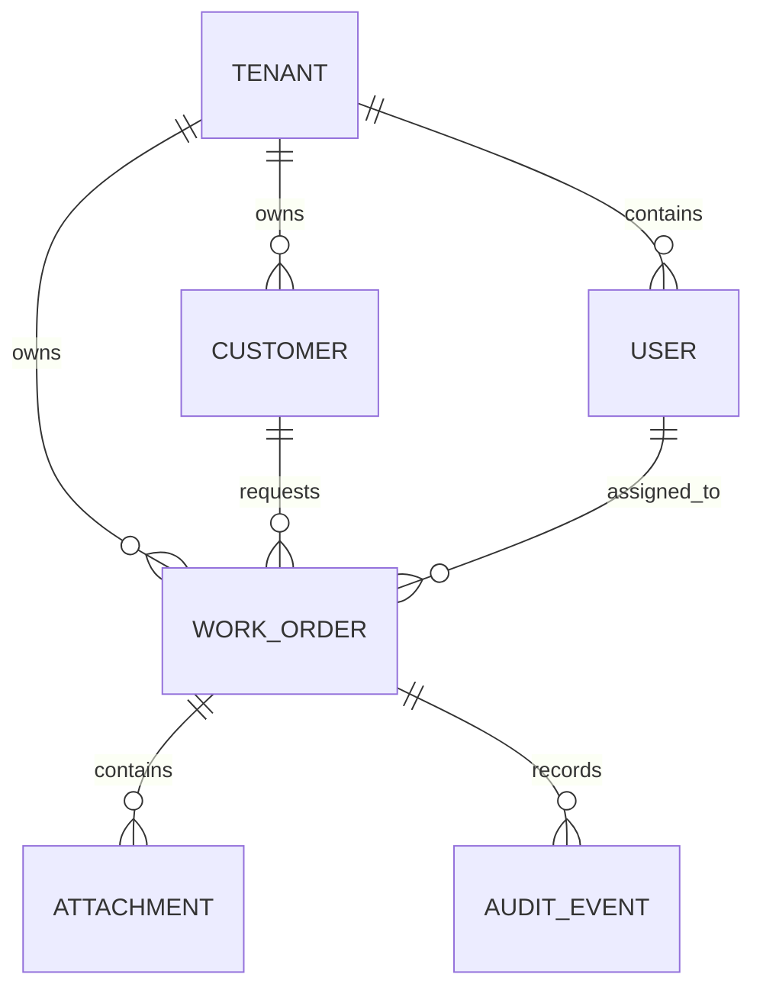

# Initial Data Model

```mermaid
erDiagram
    TENANT ||--o{ USER : contains
    TENANT ||--o{ CUSTOMER : owns
    TENANT ||--o{ WORK_ORDER : owns
    CUSTOMER ||--o{ WORK_ORDER : requests
    USER ||--o{ WORK_ORDER : assigned_to
    WORK_ORDER ||--o{ ATTACHMENT : contains
    WORK_ORDER ||--o{ AUDIT_EVENT : records
```

Every business entity will carry a `TenantId` and audit metadata. Later phases add database constraints, global query filters and cross-tenant negative tests.
