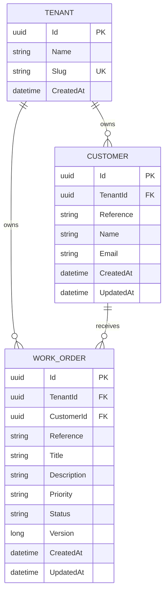

# Multi-tenant data foundation Data Model

## Key rules

- `Customer(TenantId, Reference)` is unique.
- `WorkOrder(TenantId, Reference)` is unique.
- The work-order customer relationship uses both `TenantId` and `CustomerId`.
- `Version` supports later optimistic concurrency handling.
- Timestamps use UTC.

The diagram is intentionally limited to Multi-tenant data foundation. Users, roles, assignments, attachments and audit events are added in later phases.
