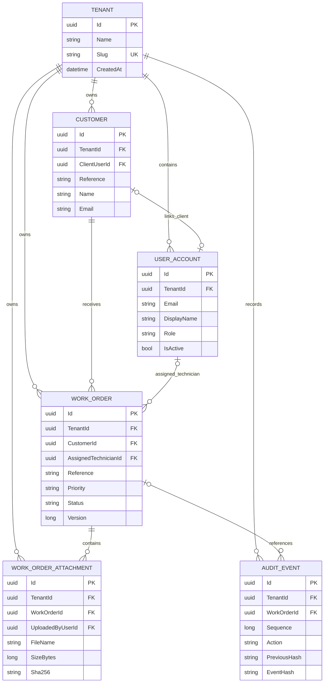

# Tenant Data Model

## Integrity Rules

- Tenant slugs are globally unique.
- Customer and work-order references are unique within a tenant.
- Tenant-owned relationships include `TenantId` in their database keys.
- A linked Client and assigned Technician must belong to the same tenant as the related record.
- Work-order `Version` is an optimistic concurrency token.
- Attachment metadata includes size, content type and SHA-256 digest.
- Audit sequences are unique per tenant.
- Audit updates and deletes are rejected by PostgreSQL.
- Timestamps are stored in UTC.
