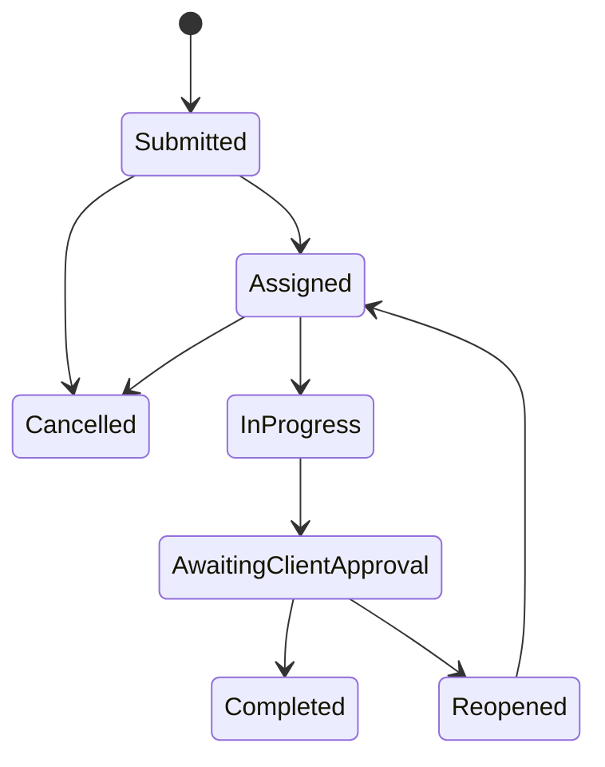

# Work-Order State Machine

## Transition Ownership

- Tenant Admin or Dispatcher assigns and cancels work.
- The assigned Technician starts work and submits completion details.
- The linked Client approves or reopens submitted work.
- Reopened work returns to Dispatcher control before reassignment.

Every write requires the current work-order `Version`. Undefined or stale transitions are rejected.
