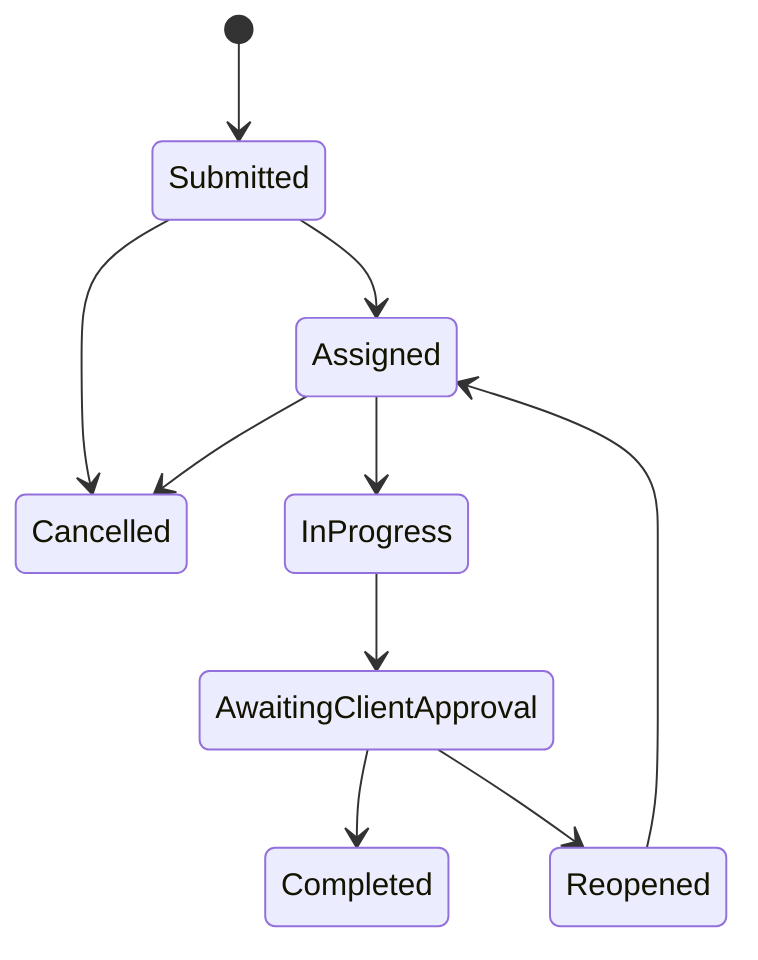

# Work Order State Machine

```mermaid
stateDiagram-v2
    [*] --> Submitted
    Submitted --> Assigned
    Submitted --> Cancelled
    Assigned --> InProgress
    Assigned --> Cancelled
    InProgress --> AwaitingClientApproval
    AwaitingClientApproval --> Completed
    AwaitingClientApproval --> Reopened
    Reopened --> Assigned
```

The domain model rejects undefined transitions. For example, a newly submitted request cannot be marked completed without assignment, work and client approval.
